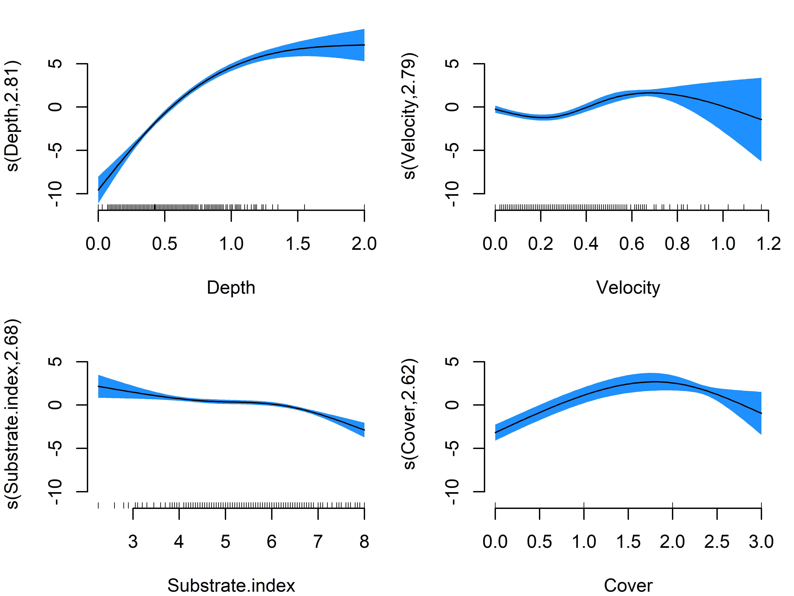
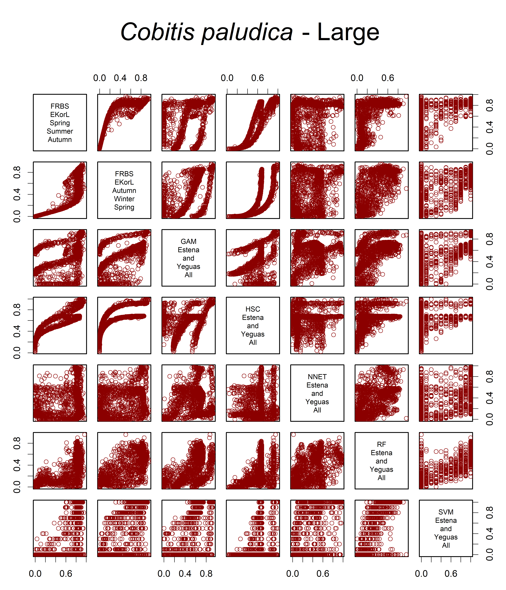

<!-- README.md is generated from README.Rmd. Please edit that file -->
<!-- badges: start -->

[](https://lifecycle.r-lib.org/articles/stages.html#experimental)
<!-- badges: end -->

# IberianFishHSMs

IberianFishHSMs: Compilation of models and tools to evaluate the habitat
suitability at the microhabitat scale for Iberian freshwater fish
species. The modelling approaches include sets of Habitat Suitability
Curves (HSCs), Artificial Neural Networks (Multilayer Perceptrons,
ANN-MLPs), Random Forests (RFs), Generalised Additive Models (GAMs), and
Support Vector Machines (SVMs), all based on empirical data collected
across several river basins in the Iberian Peninsula. The HSCs have been
reviewed by an expert panel, which co-authored the package. The package
also compiles sets of HSCs and Fuzzy Rule-Based Systems (FRBSs) based on
expert knowledge, which was gathered through on-line forms. Functions
for evaluating the habitat suitability from hydraulic simulations and
for plotting the modelled suitability are also included. A thorough
example of the capabilities of the packages appears below. The package
includes 797 microhabitat suitability models for 43 species and up to 4
size classes (Large, Medium, Small, Very small) and spawning suitability
(only for *Salmo trutta* and *Salmo salar*).

<br/>

## Authors

This package was developed by:

- **Rafael Muñoz-Mas**<sup>1</sup> (Author, Creator and Maintainer) -
  <rafa.m.mas@gmail.com>
- **Carlos Alonso**<sup>2</sup> (Contributor)
- **Enric Aparicio Manau**<sup>3</sup> (Contributor)
- **Fernando Cobo Gradín**<sup>4</sup> (Contributor)
- **Gustavo González Fernández**<sup>5</sup> (Contributor)
- **Javier Gortázar**<sup>6</sup> (Contributor)
- **Francisco Martínez-Capel**<sup>7</sup> (Contributor)
- **Francisco J. Oliva-Paterna**<sup>8</sup> (Contributor)
- **Jose Prenda**<sup>9</sup> (Contributor)
- **Jose Maria Santos**<sup>10</sup> (Contributor)
- **Rafael Miranda Ferreiro**<sup>11</sup> (Contributor)

<sup>1</sup> Tragsatec, Carrer Ramon Gordillo 7 - 46010 València, Spain.
<sup>2</sup> <sup>3</sup> GRECO, Institute of Aquatic Ecology,
University of Girona, E-17071 Girona. <sup>4</sup> Laboratorio de
Hidrobiologia, Departamento de Zoología, Genetica y Antropología Física.
Facultad de Biología. Universidad de Santiago de Compostela, 15782
Santiago de Compostela, Spain. <sup>5</sup> Icthios Gestión Ambiental
SL. <info@icthios.es>. <sup>6</sup> ECOHIDRÁULICA, S.L. C/ Villamanín
16, Madrid 28011. <sup>7</sup> Institut d’Investigació per a la Gestió
Integrada de Zones Costaneres (IGIC), Universitat Politècnica de
València, C/Paranimf, 1, 46730 Gandia, València, Spain. <sup>8</sup>
Departamento de Zoología y Antropología Física. 30100. Universidad de
Murcia. Murcia. <sup>9</sup> Dpto. de Ciencias Integradas. Universidad
de Huelva. <sup>10</sup> Forest Research Centre, Associate Laboratory
TERRA, School of Agriculture, University of Lisbon. <sup>11</sup>
Universidad de Navarra, Instituto de Biodiversidad y Medioambiente
(BIOMA), 31008 Pamplona, Navarra, Spain.

<br/>

## Installation

IberianFishHSMs can be installed from [GitHub](https://github.com/)
with:

``` r
# install.packages("devtools")
devtools::install_github("RafaMMas/IberianFishHSMs")
```

<br/>

## Example

The following example illustrates the capabilities of IberianFishHSMs
and the general workflow for predicting microhabitat suitability using
outputs from hydraulic simulations and field data. Field data includes
the substrate and cover (shelter) distribution across the study site, by
patch, pixel or cell. The data used in this example is available from
the package.

``` r
library(IberianFishHSMs)
```

<br/>

### ListModels - List available models and their key characteristics

`ListModels` allows inspecting the available models. The queries can be
categorized by Species, Size, River, Model.type, Sampled.season,
Valid.season, and/or Data.origin. This function also provides de Codes
to internally call the microhabitat suitability models during the
habitat evaluation. The output of this function also renders a summary
of their main characteristics, including sample sizes, and several
performance criteria for those models optimised through
cross-validation.

``` r
Selected.models <- ListModels(Species = "Salmo trutta", verbose = F)

## General characteristics
Selected.models$Current.summary.table[,1:15]
#>      Code                                Model           River River.short
#> 603 ABELZ   Salmo.trutta.GAM.Large.Curueno.All Curueño (Douro)     Curueno
#> 604 ABEMQ   Salmo.trutta.HSC.Large.Curueno.All Curueño (Douro)     Curueno
#> 605 ABEMV  Salmo.trutta.NNET.Large.Curueno.All Curueño (Douro)     Curueno
#> 606 ABEMZ    Salmo.trutta.RF.Large.Curueno.All Curueño (Douro)     Curueno
#> 607 ABENR   Salmo.trutta.SVM.Large.Curueno.All Curueño (Douro)     Curueno
#> 608 ABEMN  Salmo.trutta.GAM.Medium.Curueno.All Curueño (Douro)     Curueno
#> 609 ABEMR  Salmo.trutta.HSC.Medium.Curueno.All Curueño (Douro)     Curueno
#> 610 ABEMW Salmo.trutta.NNET.Medium.Curueno.All Curueño (Douro)     Curueno
#> 611 ABENO   Salmo.trutta.RF.Medium.Curueno.All Curueño (Douro)     Curueno
#> 612 ABENS  Salmo.trutta.SVM.Medium.Curueno.All Curueño (Douro)     Curueno
#> 613 ABEMO   Salmo.trutta.GAM.Small.Curueno.All Curueño (Douro)     Curueno
#> 614 ABEMS   Salmo.trutta.HSC.Small.Curueno.All Curueño (Douro)     Curueno
#> 615 ABEMX  Salmo.trutta.NNET.Small.Curueno.All Curueño (Douro)     Curueno
#> 616 ABENP    Salmo.trutta.RF.Small.Curueno.All Curueño (Douro)     Curueno
#> 617 ABENT   Salmo.trutta.SVM.Small.Curueno.All Curueño (Douro)     Curueno
#>     Model.type Default      Species   Size Sampled.season
#> 603        GAM    TRUE Salmo trutta  Large         Summer
#> 604        HSC    TRUE Salmo trutta  Large         Summer
#> 605       NNET    TRUE Salmo trutta  Large         Summer
#> 606         RF    TRUE Salmo trutta  Large         Summer
#> 607        SVM    TRUE Salmo trutta  Large         Summer
#> 608        GAM    TRUE Salmo trutta Medium         Summer
#> 609        HSC    TRUE Salmo trutta Medium         Summer
#> 610       NNET    TRUE Salmo trutta Medium         Summer
#> 611         RF    TRUE Salmo trutta Medium         Summer
#> 612        SVM    TRUE Salmo trutta Medium         Summer
#> 613        GAM    TRUE Salmo trutta  Small         Summer
#> 614        HSC    TRUE Salmo trutta  Small         Summer
#> 615       NNET    TRUE Salmo trutta  Small         Summer
#> 616         RF    TRUE Salmo trutta  Small         Summer
#> 617        SVM    TRUE Salmo trutta  Small         Summer
#>                       Valid.season Valid.seasons.short  Data.origin N.presences
#> 603 Winter; Spring; Summer; Autumn                 All Field survey          24
#> 604 Winter; Spring; Summer; Autumn                 All Field survey          24
#> 605 Winter; Spring; Summer; Autumn                 All Field survey          24
#> 606 Winter; Spring; Summer; Autumn                 All Field survey          24
#> 607 Winter; Spring; Summer; Autumn                 All Field survey          24
#> 608 Winter; Spring; Summer; Autumn                 All Field survey          81
#> 609 Winter; Spring; Summer; Autumn                 All Field survey          81
#> 610 Winter; Spring; Summer; Autumn                 All Field survey          81
#> 611 Winter; Spring; Summer; Autumn                 All Field survey          81
#> 612 Winter; Spring; Summer; Autumn                 All Field survey          81
#> 613 Winter; Spring; Summer; Autumn                 All Field survey         385
#> 614 Winter; Spring; Summer; Autumn                 All Field survey         385
#> 615 Winter; Spring; Summer; Autumn                 All Field survey         385
#> 616 Winter; Spring; Summer; Autumn                 All Field survey         385
#> 617 Winter; Spring; Summer; Autumn                 All Field survey         385
#>     N.absences N.interviews.or.studies
#> 603        896                      NA
#> 604        896                      NA
#> 605        896                      NA
#> 606        896                      NA
#> 607        896                      NA
#> 608        839                      NA
#> 609        839                      NA
#> 610        839                      NA
#> 611        839                      NA
#> 612        839                      NA
#> 613        535                      NA
#> 614        535                      NA
#> 615        535                      NA
#> 616        535                      NA
#> 617        535                      NA

## Performance

Selected.models$Current.summary.table[,16:23]
#>     True.positive False.positive True.negative False.negative Sensitivity
#> 603            24            215           681              0       1.000
#> 604            NA             NA            NA             NA          NA
#> 605            24            106           790              0       1.000
#> 606            24            106           790              0       1.000
#> 607            22            157           739              2       0.917
#> 608            70            218           621             11       0.864
#> 609            NA             NA            NA             NA          NA
#> 610            75            197           642              6       0.926
#> 611            75            197           642              6       0.926
#> 612            68            200           639             13       0.840
#> 613           275            210           325            110       0.714
#> 614            NA             NA            NA             NA          NA
#> 615           286            211           324             99       0.743
#> 616           286            211           324             99       0.743
#> 617           262            179           356            123       0.681
#>     Specificity   TSS Balanced.accuracy
#> 603       0.760 0.760             0.880
#> 604          NA    NA                NA
#> 605       0.882 0.882             0.941
#> 606       0.882 0.882             0.941
#> 607       0.825 0.741             0.871
#> 608       0.740 0.604             0.802
#> 609          NA    NA                NA
#> 610       0.765 0.691             0.846
#> 611       0.765 0.691             0.846
#> 612       0.762 0.601             0.801
#> 613       0.607 0.322             0.661
#> 614          NA    NA                NA
#> 615       0.606 0.348             0.674
#> 616       0.606 0.348             0.674
#> 617       0.665 0.346             0.673

## Models and Codes

Selected.models[2:3]
#> $Models
#>  [1] "Salmo.trutta.GAM.Large.Curueno.All"  
#>  [2] "Salmo.trutta.HSC.Large.Curueno.All"  
#>  [3] "Salmo.trutta.NNET.Large.Curueno.All" 
#>  [4] "Salmo.trutta.RF.Large.Curueno.All"   
#>  [5] "Salmo.trutta.SVM.Large.Curueno.All"  
#>  [6] "Salmo.trutta.GAM.Medium.Curueno.All" 
#>  [7] "Salmo.trutta.HSC.Medium.Curueno.All" 
#>  [8] "Salmo.trutta.NNET.Medium.Curueno.All"
#>  [9] "Salmo.trutta.RF.Medium.Curueno.All"  
#> [10] "Salmo.trutta.SVM.Medium.Curueno.All" 
#> [11] "Salmo.trutta.GAM.Small.Curueno.All"  
#> [12] "Salmo.trutta.HSC.Small.Curueno.All"  
#> [13] "Salmo.trutta.NNET.Small.Curueno.All" 
#> [14] "Salmo.trutta.RF.Small.Curueno.All"   
#> [15] "Salmo.trutta.SVM.Small.Curueno.All"  
#> 
#> $Codes
#>  [1] "ABELZ" "ABEMQ" "ABEMV" "ABEMZ" "ABENR" "ABEMN" "ABEMR" "ABEMW" "ABENO"
#> [10] "ABENS" "ABEMO" "ABEMS" "ABEMX" "ABENP" "ABENT"
```

`ListModels` output values can be use directly within
`PredictHabitatSuitability` to carry out habitat evaluations. In
particula, `$Codes` are the names used to store internally the available
microhabitat suitability models.

<br/>

### ListSelectedCoverTypes - List selected cover types in each microhabitat suitability model

There exist an interaction between training data and the selected
modelling technique, which can vary variable effects and importance
(Eugster, Leisch, and Strobl 2014). By means of cross-validation, during
the development of the microhabitat suitability models we carried out a
variable selection approach discarding those cover types that not
improved model performance for Machine Learning (i.e., ANN-MLPs, RFs,
SVMs) and statistical approaches (i.e., GAMs) and an analogous approach
during the development of the Habitat Suitability Curves/Criteria (HSCs)
and Fuzzy Rule-based Systems (FRBSs). This approach lead to different
sets of relevant cover types in each model, although the core of
relevant cover types is expected to coincide. The function
`ListSelectedCoverTypes` allows inspecting the selected cover types for
each model. The queries can be categorized by Species, Size, River,
Model.type, Sampled.season, Valid.season, and/or Data.origin. When
evaluating the microhabitat suitability, `PredictHabitatSuitability`
selects and aggregates the appropriate cover types internally.
Therefore, this function does not need to be called explicitly.

``` r

ListSelectedCoverTypes(Species = "Salmo trutta")
#>      Code                                Model Leaves Algae  Root
#> 603 ABELZ   Salmo.trutta.GAM.Large.Curueno.All   TRUE FALSE  TRUE
#> 604 ABEMQ   Salmo.trutta.HSC.Large.Curueno.All  FALSE FALSE  TRUE
#> 605 ABEMV  Salmo.trutta.NNET.Large.Curueno.All   TRUE FALSE  TRUE
#> 606 ABEMZ    Salmo.trutta.RF.Large.Curueno.All  FALSE FALSE  TRUE
#> 607 ABENR   Salmo.trutta.SVM.Large.Curueno.All   TRUE FALSE  TRUE
#> 608 ABEMN  Salmo.trutta.GAM.Medium.Curueno.All   TRUE FALSE FALSE
#> 609 ABEMR  Salmo.trutta.HSC.Medium.Curueno.All  FALSE FALSE  TRUE
#> 610 ABEMW Salmo.trutta.NNET.Medium.Curueno.All  FALSE FALSE FALSE
#> 611 ABENO   Salmo.trutta.RF.Medium.Curueno.All  FALSE FALSE FALSE
#> 612 ABENS  Salmo.trutta.SVM.Medium.Curueno.All  FALSE  TRUE FALSE
#> 613 ABEMO   Salmo.trutta.GAM.Small.Curueno.All  FALSE FALSE FALSE
#> 614 ABEMS   Salmo.trutta.HSC.Small.Curueno.All  FALSE FALSE  TRUE
#> 615 ABEMX  Salmo.trutta.NNET.Small.Curueno.All  FALSE FALSE  TRUE
#> 616 ABENP    Salmo.trutta.RF.Small.Curueno.All   TRUE FALSE  TRUE
#> 617 ABENT   Salmo.trutta.SVM.Small.Curueno.All   TRUE  TRUE FALSE
#>     Aquatic.vegetation  Reed  Wood  Sand  Rock  Cave Shade
#> 603               TRUE FALSE FALSE FALSE  TRUE  TRUE  TRUE
#> 604               TRUE  TRUE  TRUE FALSE  TRUE  TRUE  TRUE
#> 605               TRUE  TRUE FALSE FALSE FALSE  TRUE  TRUE
#> 606               TRUE FALSE FALSE FALSE FALSE FALSE  TRUE
#> 607              FALSE  TRUE FALSE FALSE FALSE FALSE  TRUE
#> 608               TRUE FALSE  TRUE  TRUE FALSE  TRUE  TRUE
#> 609               TRUE  TRUE  TRUE FALSE  TRUE  TRUE  TRUE
#> 610               TRUE FALSE  TRUE FALSE FALSE  TRUE  TRUE
#> 611              FALSE FALSE  TRUE FALSE FALSE  TRUE  TRUE
#> 612              FALSE FALSE  TRUE  TRUE FALSE  TRUE  TRUE
#> 613               TRUE  TRUE FALSE FALSE  TRUE  TRUE  TRUE
#> 614               TRUE  TRUE  TRUE FALSE  TRUE FALSE  TRUE
#> 615               TRUE  TRUE  TRUE FALSE  TRUE FALSE  TRUE
#> 616               TRUE FALSE FALSE  TRUE  TRUE  TRUE  TRUE
#> 617              FALSE  TRUE  TRUE  TRUE  TRUE  TRUE FALSE
```

<br/>

### PlotHabitatSuitabilityModels - Carry out sensitivity analyses

The package includes a number of models (i.e., 797) and species (i.e.,
43) of several size classes and activities. Among other things, the
available models vary by modelling technique, sampling site and the
aggregation of data from different sites. The variable `Default`
obtained with `ListModels` indicates which models are recommended
because it was considered they performed and generalised better and/or
were developed with data covering a large range of the microhabitat
variables. Nevertheless, users can select other models when they
consider it preferable. For example, when they are going to evaluate the
microhabitat suitability in the basin where data for an alternative
model was collected. In addition to `ListSelectedCoverTypes`, users can
carry out sensitivity analyses to compare the predictions of the
different available models. This allows inspecting their performance
before selecting any alternative model or set of models. The sensitivity
analysis can be carried out employing the function
`PlotHabitatSuitabilityModels` as follows:

``` r

## Pseudochondrostoma.polylepis, large, FRBS for Spring, Summer, and Autumn

(Selected.model <- ListModels(Species = "Pseudochondrostoma polylepis", verbose = FALSE)$Codes[1])
#> [1] "ABEIO"

PlotHabitatSuitabilityModels(Selected.model = Selected.model, Quantiles = TRUE)
```


**Figure 1** - Sensitivity analysis (i.e., partial dependence plots) for
*Pseudochondrostoma polylepis* large. The figure shows the results for
the Fuzzy Rule-Based System (FRBS) to evaluate the microhabitat
suitability during Spring, Summer, and Autumn.

This function generates partial dependence-like plots for microhabitat
suitability models based on the provided data and selected model
(Friedman 2001). Partial dependence plots are created by varying one
variable over its range of values while averaging the model’s
predictions over all the other features. This method isolates the effect
of that single variable on the outcome and thus determining the overall
effect. The function allows employing a user defined dataset to test
especific combinations of variable values.

<br/>

### Load.and.print.model - Load and/or print a specific model

``` r
(Selected.model <- ListModels(Species = "Salmo trutta", Model.type = "GAM", verbose = FALSE))
#> $Current.summary.table
#>      Code                               Model           River River.short
#> 603 ABELZ  Salmo.trutta.GAM.Large.Curueno.All Curueño (Douro)     Curueno
#> 608 ABEMN Salmo.trutta.GAM.Medium.Curueno.All Curueño (Douro)     Curueno
#> 613 ABEMO  Salmo.trutta.GAM.Small.Curueno.All Curueño (Douro)     Curueno
#>     Model.type Default      Species   Size Sampled.season
#> 603        GAM    TRUE Salmo trutta  Large         Summer
#> 608        GAM    TRUE Salmo trutta Medium         Summer
#> 613        GAM    TRUE Salmo trutta  Small         Summer
#>                       Valid.season Valid.seasons.short  Data.origin N.presences
#> 603 Winter; Spring; Summer; Autumn                 All Field survey          24
#> 608 Winter; Spring; Summer; Autumn                 All Field survey          81
#> 613 Winter; Spring; Summer; Autumn                 All Field survey         385
#>     N.absences N.interviews.or.studies True.positive False.positive
#> 603        896                      NA            24            215
#> 608        839                      NA            70            218
#> 613        535                      NA           275            210
#>     True.negative False.negative Sensitivity Specificity   TSS
#> 603           681              0       1.000       0.760 0.760
#> 608           621             11       0.864       0.740 0.604
#> 613           325            110       0.714       0.607 0.322
#>     Balanced.accuracy
#> 603             0.880
#> 608             0.802
#> 613             0.661
#> 
#> $Models
#> [1] "Salmo.trutta.GAM.Large.Curueno.All"  "Salmo.trutta.GAM.Medium.Curueno.All"
#> [3] "Salmo.trutta.GAM.Small.Curueno.All" 
#> 
#> $Codes
#> [1] "ABELZ" "ABEMN" "ABEMO"

(Selected.model <- Load.and.print.model(Selected.model = Selected.model$Codes[1]))
#> $Selected.cover.types
#>             Leaves              Algae               Root Aquatic.vegetation 
#>               TRUE              FALSE               TRUE               TRUE 
#>               Reed               Wood               Sand               Rock 
#>              FALSE              FALSE              FALSE               TRUE 
#>               Cave              Shade 
#>               TRUE               TRUE 
#> 
#> $Model.type
#> [1] "GAM"
#> 
#> $Model
#> 
#> Call:  mgcv:::bam(formula = as.formula(paste(Selected.species, "~", 
#>     C.terms)), family = binomial(), data = C.sample.dataset, 
#>     weights = ifelse(C.sample.dataset[, Selected.species] == 
#>         1, Chromosome[-c(1:length(Cover.types.complete.list))][1], 
#>         100 - Chromosome[-c(1:length(Cover.types.complete.list))][1]), 
#>     method = "fREML", gamma = 1.2, discrete = TRUE)
#> 
#> Coefficients:
#>          (Intercept)            s(Depth).1            s(Depth).2  
#>              1.28199               5.31493              12.54161  
#>           s(Depth).3         s(Velocity).1         s(Velocity).2  
#>             12.44123               0.08129               1.14827  
#>        s(Velocity).3  s(Substrate.index).1  s(Substrate.index).2  
#>              2.00335              -1.70746              -2.38911  
#> s(Substrate.index).3            s(Cover).1            s(Cover).2  
#>             -9.81859               2.96345               5.10960  
#>           s(Cover).3  
#>              4.24585  
#> 
#> Degrees of Freedom: 939 Total (i.e. Null);  928.0187 Residual
#> Null Deviance:       3891 
#> Residual Deviance: 1617  AIC: 1639
#> $Selected.cover.types
#>             Leaves              Algae               Root Aquatic.vegetation 
#>               TRUE              FALSE               TRUE               TRUE 
#>               Reed               Wood               Sand               Rock 
#>              FALSE              FALSE              FALSE               TRUE 
#>               Cave              Shade 
#>               TRUE               TRUE 
#> 
#> $Model.type
#> [1] "GAM"
#> 
#> $Model
#> 
#> Call:  mgcv:::bam(formula = as.formula(paste(Selected.species, "~", 
#>     C.terms)), family = binomial(), data = C.sample.dataset, 
#>     weights = ifelse(C.sample.dataset[, Selected.species] == 
#>         1, Chromosome[-c(1:length(Cover.types.complete.list))][1], 
#>         100 - Chromosome[-c(1:length(Cover.types.complete.list))][1]), 
#>     method = "fREML", gamma = 1.2, discrete = TRUE)
#> 
#> Coefficients:
#>          (Intercept)            s(Depth).1            s(Depth).2  
#>              1.28199               5.31493              12.54161  
#>           s(Depth).3         s(Velocity).1         s(Velocity).2  
#>             12.44123               0.08129               1.14827  
#>        s(Velocity).3  s(Substrate.index).1  s(Substrate.index).2  
#>              2.00335              -1.70746              -2.38911  
#> s(Substrate.index).3            s(Cover).1            s(Cover).2  
#>             -9.81859               2.96345               5.10960  
#>           s(Cover).3  
#>              4.24585  
#> 
#> Degrees of Freedom: 939 Total (i.e. Null);  928.0187 Residual
#> Null Deviance:       3891 
#> Residual Deviance: 1617  AIC: 1639
```

<br/>

Each group of models was developed employing specific *R* packages:

- Artificial Neural Networks (Multilayer Perceptrons, ANN-MLPs) were
  developed with the R package `nnet`
- Random Forests (RFs) with `ranger`
- Generalised Additive Models (GAMs) with `mgcv`
- Support Vector Machines (SVMs) with `e1071`
- Habitat Suitability Curves (HSCs) with `FuzzyFishHS`
  (<https://github.com/RafaMMas/FuzzyFishHS>)
- Fuzzy Rule-Based Systems (FRBSs) with `FuzzyFishHS`
  (<https://github.com/RafaMMas/FuzzyFishHS>)

Therefore, once a specific model has been loaded it is possible to
harness the capabilites of each specific package to, for example, plot
directly the selected model.

``` r
library(mgcv)
#> Warning: package 'mgcv' was built under R version 4.1.3
#> Loading required package: nlme
#> This is mgcv 1.8-42. For overview type 'help("mgcv-package")'.
par(mar = c(4,4,1,1), bty = "n")
plot.gam(Selected.model$Model, pages = 1, shade=TRUE, shade.col = "dodgerblue")
```

 **Figure
2** - Plot of the Generalised Additive Model for *Salmo trutta* Large
obtained with data collected in the Curueño River (Douro) and valid all
year round.

The different option to, for example, plot each models depend on each
specific package and in some cases suchs the SVMs obtained with `e1071`
require indirect approaches for plotting. For instance, using the *R*
package `pdp` (Greenwell 2017).

<br/>

### Habitat suitability prediction

Habitat suitability predictions are carried out based on mean flow
velocity (m/s), water depth (m) substrate index (-) and the sum of the
number of relevant types of cover in the evaluated microhabitats
(i.e. pixels or cells from the hydraulic simulation). The package
includes functions to prepare the input data. Additionally, the package
includes data on a typical output from a hydraulic simulation and field
survey. In particular, it includes data on velocity and depth for 40
simulated flows and the substrate composition and cover availability in
the site of the Serpis River Basin (Eastern Iberian Peninsula) studied
by Muñoz-Mas et all (2024).

``` r
data("Velocity.example.df")
data("Depth.example.df")
data("Substrate.index.example.df")
data("Cover.example.df")

summary(Velocity.example.df[,1:6])
#>        x                y           Velocity.0.05      Velocity.0.1     
#>  Min.   :732536   Min.   :4302306   Min.   :0.00000   Min.   :0.000000  
#>  1st Qu.:732596   1st Qu.:4302440   1st Qu.:0.00000   1st Qu.:0.000000  
#>  Median :732614   Median :4302560   Median :0.00000   Median :0.000000  
#>  Mean   :732615   Mean   :4302545   Mean   :0.00439   Mean   :0.009547  
#>  3rd Qu.:732638   3rd Qu.:4302660   3rd Qu.:0.00480   3rd Qu.:0.010900  
#>  Max.   :732686   Max.   :4302710   Max.   :0.15973   Max.   :0.235300  
#>   Velocity.0.2      Velocity.0.3    
#>  Min.   :0.00000   Min.   :0.00000  
#>  1st Qu.:0.00000   1st Qu.:0.00000  
#>  Median :0.00000   Median :0.00020  
#>  Mean   :0.02132   Mean   :0.03182  
#>  3rd Qu.:0.02330   3rd Qu.:0.03495  
#>  Max.   :0.46400   Max.   :1.10900
summary(Depth.example.df[,1:6])
#>        x                y             Depth.0.05       Depth.0.1     
#>  Min.   :732536   Min.   :4302306   Min.   :0.0001   Min.   :0.0001  
#>  1st Qu.:732596   1st Qu.:4302440   1st Qu.:0.1022   1st Qu.:0.0986  
#>  Median :732614   Median :4302560   Median :0.2598   Median :0.2629  
#>  Mean   :732615   Mean   :4302545   Mean   :0.3001   Mean   :0.3008  
#>  3rd Qu.:732638   3rd Qu.:4302660   3rd Qu.:0.4631   3rd Qu.:0.4587  
#>  Max.   :732686   Max.   :4302710   Max.   :1.2471   Max.   :1.2837  
#>                                     NA's   :1917     NA's   :1712    
#>    Depth.0.2        Depth.0.3     
#>  Min.   :0.0002   Min.   :0.0002  
#>  1st Qu.:0.1005   1st Qu.:0.1087  
#>  Median :0.2808   Median :0.2960  
#>  Mean   :0.3147   Mean   :0.3321  
#>  3rd Qu.:0.4729   3rd Qu.:0.4987  
#>  Max.   :1.3332   Max.   :1.3676  
#>  NA's   :1548     NA's   :1482
summary(Substrate.index.example.df[,-c(1:2)])
#>    Vegetation      Silt             Sand    Fine.gravel         Gravel      
#>  Min.   :0    Min.   :  0.00   Min.   :0   Min.   :  0.00   Min.   :  0.00  
#>  1st Qu.:0    1st Qu.:  0.00   1st Qu.:0   1st Qu.:  0.00   1st Qu.:  0.00  
#>  Median :0    Median : 15.00   Median :0   Median :  0.00   Median :  0.00  
#>  Mean   :0    Mean   : 20.59   Mean   :0   Mean   : 10.49   Mean   : 15.61  
#>  3rd Qu.:0    3rd Qu.: 50.00   3rd Qu.:0   3rd Qu.:  0.00   3rd Qu.: 20.00  
#>  Max.   :0    Max.   :100.00   Max.   :0   Max.   :100.00   Max.   :100.00  
#>     Cobbles          Boulders         Bed.rock      
#>  Min.   :  0.00   Min.   :  0.00   Min.   :  0.000  
#>  1st Qu.:  0.00   1st Qu.:  0.00   1st Qu.:  0.000  
#>  Median : 50.00   Median :  0.00   Median :  0.000  
#>  Mean   : 38.49   Mean   : 10.25   Mean   :  4.571  
#>  3rd Qu.: 50.00   3rd Qu.:  0.00   3rd Qu.:  0.000  
#>  Max.   :100.00   Max.   :100.00   Max.   :100.000
summary(Cover.example.df[,-c(1:2)])
#>      Leaves      Algae        Root   Aquatic.vegetation      Reed        
#>  Min.   :0   Min.   :0   Min.   :0   Min.   :0.00000    Min.   :0.00000  
#>  1st Qu.:0   1st Qu.:0   1st Qu.:0   1st Qu.:0.00000    1st Qu.:0.00000  
#>  Median :0   Median :0   Median :0   Median :0.00000    Median :0.00000  
#>  Mean   :0   Mean   :0   Mean   :0   Mean   :0.01703    Mean   :0.01136  
#>  3rd Qu.:0   3rd Qu.:0   3rd Qu.:0   3rd Qu.:0.00000    3rd Qu.:0.00000  
#>  Max.   :0   Max.   :0   Max.   :0   Max.   :1.00000    Max.   :1.00000  
#>       Wood             Sand        Rock             Cave             Shade     
#>  Min.   :0.0000   Min.   :0   Min.   :0.0000   Min.   :0.00000   Min.   :0.00  
#>  1st Qu.:0.0000   1st Qu.:0   1st Qu.:0.0000   1st Qu.:0.00000   1st Qu.:0.00  
#>  Median :0.0000   Median :0   Median :0.0000   Median :0.00000   Median :1.00  
#>  Mean   :0.4767   Mean   :0   Mean   :0.1612   Mean   :0.02177   Mean   :0.53  
#>  3rd Qu.:1.0000   3rd Qu.:0   3rd Qu.:0.0000   3rd Qu.:0.00000   3rd Qu.:1.00  
#>  Max.   :1.0000   Max.   :0   Max.   :1.0000   Max.   :1.00000   Max.   :1.00
```

The function `SubstrateIndex` computes the substrate index as a weighted
aggregation of the percentage of different granulometry classes (%). The
substrate classes originally used corresponded to a simplification of
the the American Geophysical Union size scale, namely silt (Ø ≤ 62 µm),
sand (62 µm \> Ø ≤ 2 mm), fine gravel (2 \> Ø ≤ 8 mm), gravel (8 \> Ø ≤
64 mm), cobbles (64 \> Ø ≤ 256 mm), boulders (Ø \> 256 mm) and bedrock
Muñoz-Mas et al. (2017). The package includes some examples to
illustrate the structure of the input files.

``` r
data(Substrate.index.example.df)

summary(Substrate.index.example.df)
#>        x                y             Vegetation      Silt             Sand  
#>  Min.   :732536   Min.   :4302306   Min.   :0    Min.   :  0.00   Min.   :0  
#>  1st Qu.:732596   1st Qu.:4302440   1st Qu.:0    1st Qu.:  0.00   1st Qu.:0  
#>  Median :732614   Median :4302560   Median :0    Median : 15.00   Median :0  
#>  Mean   :732615   Mean   :4302545   Mean   :0    Mean   : 20.59   Mean   :0  
#>  3rd Qu.:732638   3rd Qu.:4302660   3rd Qu.:0    3rd Qu.: 50.00   3rd Qu.:0  
#>  Max.   :732686   Max.   :4302710   Max.   :0    Max.   :100.00   Max.   :0  
#>   Fine.gravel         Gravel          Cobbles          Boulders     
#>  Min.   :  0.00   Min.   :  0.00   Min.   :  0.00   Min.   :  0.00  
#>  1st Qu.:  0.00   1st Qu.:  0.00   1st Qu.:  0.00   1st Qu.:  0.00  
#>  Median :  0.00   Median :  0.00   Median : 50.00   Median :  0.00  
#>  Mean   : 10.49   Mean   : 15.61   Mean   : 38.49   Mean   : 10.25  
#>  3rd Qu.:  0.00   3rd Qu.: 20.00   3rd Qu.: 50.00   3rd Qu.:  0.00  
#>  Max.   :100.00   Max.   :100.00   Max.   :100.00   Max.   :100.00  
#>     Bed.rock      
#>  Min.   :  0.000  
#>  1st Qu.:  0.000  
#>  Median :  0.000  
#>  Mean   :  4.571  
#>  3rd Qu.:  0.000  
#>  Max.   :100.000

head(SubstrateIndex(Substrate.index.example.df, check.completeness = FALSE)) # check.completeness allows inspecting whether names and percentages are correct.
#>   Substrate.index
#> 1               3
#> 2               3
#> 3               3
#> 4               3
#> 5               3
#> 6               3

Substrate.index <- SubstrateIndex(Substrate.index.example.df, check.completeness = FALSE)
```

``` r

Selected.species <- "Cobitis paludica"

Selected.size <- "Large"
  
(Selected.models <- ListModels(Species = Selected.species, Size = Selected.size)) ## example determining the selected models 
#>      Code                                                  Model
#> 138 ABCKQ Cobitis.paludica.FRBS.Large.EKorL.Spring.Summer.Autumn
#> 139 ABCKP Cobitis.paludica.FRBS.Large.EKorL.Autumn.Winter.Spring
#> 161 ABCKU       Cobitis.paludica.GAM.Large.Estena.and.Yeguas.All
#> 162 ABCLQ       Cobitis.paludica.HSC.Large.Estena.and.Yeguas.All
#> 163 ABCMN      Cobitis.paludica.NNET.Large.Estena.and.Yeguas.All
#> 164 ABCMV        Cobitis.paludica.RF.Large.Estena.and.Yeguas.All
#> 165 ABCNR       Cobitis.paludica.SVM.Large.Estena.and.Yeguas.All
#>                                         River       River.short Model.type
#> 138                                                       EKorL       FRBS
#> 139                                                       EKorL       FRBS
#> 161 Estena (Guadiana) + Yeguas (Guadalquivir) Estena.and.Yeguas        GAM
#> 162 Estena (Guadiana) + Yeguas (Guadalquivir) Estena.and.Yeguas        HSC
#> 163 Estena (Guadiana) + Yeguas (Guadalquivir) Estena.and.Yeguas       NNET
#> 164 Estena (Guadiana) + Yeguas (Guadalquivir) Estena.and.Yeguas         RF
#> 165 Estena (Guadiana) + Yeguas (Guadalquivir) Estena.and.Yeguas        SVM
#>     Default          Species  Size Sampled.season
#> 138    TRUE Cobitis paludica Large               
#> 139    TRUE Cobitis paludica Large               
#> 161    TRUE Cobitis paludica Large         Summer
#> 162    TRUE Cobitis paludica Large         Summer
#> 163    TRUE Cobitis paludica Large         Summer
#> 164    TRUE Cobitis paludica Large         Summer
#> 165    TRUE Cobitis paludica Large         Summer
#>                       Valid.season  Valid.seasons.short      Data.origin
#> 138         Spring; Summer; Autumn Spring.Summer.Autumn Expert knowledge
#> 139         Autumn; Winter; Spring Autumn.Winter.Spring Expert knowledge
#> 161 Winter; Spring; Summer; Autumn                  All     Field survey
#> 162 Winter; Spring; Summer; Autumn                  All     Field survey
#> 163 Winter; Spring; Summer; Autumn                  All     Field survey
#> 164 Winter; Spring; Summer; Autumn                  All     Field survey
#> 165 Winter; Spring; Summer; Autumn                  All     Field survey
#>     N.presences N.absences N.interviews.or.studies True.positive False.positive
#> 138          NA         NA                       7            NA             NA
#> 139          NA         NA                       7            NA             NA
#> 161          43       1950                      NA            39           1200
#> 162          43       1953                      NA            NA             NA
#> 163          43       1950                      NA            38            959
#> 164          43       1950                      NA            38            959
#> 165          43       1950                      NA            36            678
#>     True.negative False.negative Sensitivity Specificity   TSS
#> 138            NA             NA          NA          NA    NA
#> 139            NA             NA          NA          NA    NA
#> 161           750              4       0.907       0.385 0.292
#> 162            NA             NA          NA          NA    NA
#> 163           991              5       0.884       0.508 0.392
#> 164           991              5       0.884       0.508 0.392
#> 165          1272              7       0.837       0.652 0.490
#>     Balanced.accuracy
#> 138                NA
#> 139                NA
#> 161             0.646
#> 162                NA
#> 163             0.696
#> 164             0.696
#> 165             0.745
#> $Current.summary.table
#>      Code                                                  Model
#> 138 ABCKQ Cobitis.paludica.FRBS.Large.EKorL.Spring.Summer.Autumn
#> 139 ABCKP Cobitis.paludica.FRBS.Large.EKorL.Autumn.Winter.Spring
#> 161 ABCKU       Cobitis.paludica.GAM.Large.Estena.and.Yeguas.All
#> 162 ABCLQ       Cobitis.paludica.HSC.Large.Estena.and.Yeguas.All
#> 163 ABCMN      Cobitis.paludica.NNET.Large.Estena.and.Yeguas.All
#> 164 ABCMV        Cobitis.paludica.RF.Large.Estena.and.Yeguas.All
#> 165 ABCNR       Cobitis.paludica.SVM.Large.Estena.and.Yeguas.All
#>                                         River       River.short Model.type
#> 138                                                       EKorL       FRBS
#> 139                                                       EKorL       FRBS
#> 161 Estena (Guadiana) + Yeguas (Guadalquivir) Estena.and.Yeguas        GAM
#> 162 Estena (Guadiana) + Yeguas (Guadalquivir) Estena.and.Yeguas        HSC
#> 163 Estena (Guadiana) + Yeguas (Guadalquivir) Estena.and.Yeguas       NNET
#> 164 Estena (Guadiana) + Yeguas (Guadalquivir) Estena.and.Yeguas         RF
#> 165 Estena (Guadiana) + Yeguas (Guadalquivir) Estena.and.Yeguas        SVM
#>     Default          Species  Size Sampled.season
#> 138    TRUE Cobitis paludica Large               
#> 139    TRUE Cobitis paludica Large               
#> 161    TRUE Cobitis paludica Large         Summer
#> 162    TRUE Cobitis paludica Large         Summer
#> 163    TRUE Cobitis paludica Large         Summer
#> 164    TRUE Cobitis paludica Large         Summer
#> 165    TRUE Cobitis paludica Large         Summer
#>                       Valid.season  Valid.seasons.short      Data.origin
#> 138         Spring; Summer; Autumn Spring.Summer.Autumn Expert knowledge
#> 139         Autumn; Winter; Spring Autumn.Winter.Spring Expert knowledge
#> 161 Winter; Spring; Summer; Autumn                  All     Field survey
#> 162 Winter; Spring; Summer; Autumn                  All     Field survey
#> 163 Winter; Spring; Summer; Autumn                  All     Field survey
#> 164 Winter; Spring; Summer; Autumn                  All     Field survey
#> 165 Winter; Spring; Summer; Autumn                  All     Field survey
#>     N.presences N.absences N.interviews.or.studies True.positive False.positive
#> 138          NA         NA                       7            NA             NA
#> 139          NA         NA                       7            NA             NA
#> 161          43       1950                      NA            39           1200
#> 162          43       1953                      NA            NA             NA
#> 163          43       1950                      NA            38            959
#> 164          43       1950                      NA            38            959
#> 165          43       1950                      NA            36            678
#>     True.negative False.negative Sensitivity Specificity   TSS
#> 138            NA             NA          NA          NA    NA
#> 139            NA             NA          NA          NA    NA
#> 161           750              4       0.907       0.385 0.292
#> 162            NA             NA          NA          NA    NA
#> 163           991              5       0.884       0.508 0.392
#> 164           991              5       0.884       0.508 0.392
#> 165          1272              7       0.837       0.652 0.490
#>     Balanced.accuracy
#> 138                NA
#> 139                NA
#> 161             0.646
#> 162                NA
#> 163             0.696
#> 164             0.696
#> 165             0.745
#> 
#> $Models
#> [1] "Cobitis.paludica.FRBS.Large.EKorL.Spring.Summer.Autumn"
#> [2] "Cobitis.paludica.FRBS.Large.EKorL.Autumn.Winter.Spring"
#> [3] "Cobitis.paludica.GAM.Large.Estena.and.Yeguas.All"      
#> [4] "Cobitis.paludica.HSC.Large.Estena.and.Yeguas.All"      
#> [5] "Cobitis.paludica.NNET.Large.Estena.and.Yeguas.All"     
#> [6] "Cobitis.paludica.RF.Large.Estena.and.Yeguas.All"       
#> [7] "Cobitis.paludica.SVM.Large.Estena.and.Yeguas.All"      
#> 
#> $Codes
#> [1] "ABCKQ" "ABCKP" "ABCKU" "ABCLQ" "ABCMN" "ABCMV" "ABCNR"
```

``` r
Hydraulics <- data.frame(Velocity = Velocity.example.df$Velocity.0.05,
                         Depth = Depth.example.df$Depth.0.05,
                         Substrate.index = Substrate.index,
                         Cover.example.df[,-c(1:2)])

Predictions <- PredictHabitatSuitability(Selected.models = Selected.models, data = Hydraulics, HSC.aggregation = "geometric")
```

``` r

summary(Predictions)
#>      ABCKQ            ABCKP            ABCKU            ABCLQ       
#>  Min.   :0.0000   Min.   :0.0000   Min.   :0.1682   Min.   :0.0164  
#>  1st Qu.:0.2603   1st Qu.:0.0663   1st Qu.:0.3933   1st Qu.:0.4832  
#>  Median :0.7912   Median :0.4358   Median :0.5730   Median :0.6517  
#>  Mean   :0.5840   Mean   :0.4268   Mean   :0.5380   Mean   :0.5834  
#>  3rd Qu.:0.8149   3rd Qu.:0.7942   3rd Qu.:0.6585   3rd Qu.:0.6684  
#>  Max.   :0.9403   Max.   :0.9420   Max.   :0.9192   Max.   :0.9749  
#>  NA's   :1917     NA's   :1917     NA's   :1917     NA's   :1917    
#>      ABCMN            ABCMV            ABCNR       
#>  Min.   :0.0434   Min.   :0.0000   Min.   :0.0000  
#>  1st Qu.:0.3367   1st Qu.:0.1098   1st Qu.:0.0000  
#>  Median :0.5309   Median :0.3065   Median :0.6000  
#>  Mean   :0.4648   Mean   :0.3356   Mean   :0.5188  
#>  3rd Qu.:0.6013   3rd Qu.:0.5514   3rd Qu.:1.0000  
#>  Max.   :0.9868   Max.   :0.9271   Max.   :1.0000  
#>  NA's   :1917     NA's   :1917     NA's   :1917
```

``` r
pairs(Predictions)
```



``` r

library(sf)
#> Warning: package 'sf' was built under R version 4.1.3
#> Linking to GEOS 3.10.2, GDAL 3.4.1, PROJ 7.2.1; sf_use_s2() is TRUE

Coordinates <- st_as_sf(Velocity.example.df[,c("x", "y")], coords = c("x", "y"))

Colors.suitability <- colorRampPalette(c("red2", "darkorange", "gold", "green2", "dodgerblue"))(100)

# sf_points <- st_as_sf(data.frame(Example.hydrulic.simulation.depth[,c("x", "y")], Predictions), coords = c("x", "y"), crs = 32630)

Model.names <- sapply(colnames(Predictions), function(x){
  x <- gsub(x = x, pattern = paste0(gsub(Selected.species, pattern = " ", replacement = "."), "."), replacement = "")
  x <- gsub(x = x, pattern = paste0(Selected.size, "."), replacement = "")
  x
})

op <- par(mfrow = c(ceiling(length(Selected.models$Models)^0.5), ceiling(length(Selected.models$Models)^0.5)), oma = c(0.5,0.5,2.5,0.5), mar = c(4,4,2,0.5))

for(i in 1:ncol(Predictions))
{
  plot(st_geometry(Coordinates), pch = 15, cex = 0.5, bty = "n", 
     col = Colors.suitability[cut(Predictions[,i], breaks = seq(0, 1, length = 101), labels = 1:100, include.lowest = T)], 
     xlab = "X", ylab = "Y")
  Axis(side = 1, cex.axis = 0.5)
  Axis(side = 2, cex.axis = 0.5) 
  title(Model.names[i], font.main = 1, cex.main = 0.9)
}

par(op)

Species <- Selected.species
Size <- paste0(" - ", Selected.size)
title(substitute(expr = paste(italic(Species), Size, sep =" "), env = list(Species = Species, Size = Size)), outer = T, adj = 0.05, cex.main = 2)
```


``` r

par(op)
```

<br/>

## Bibliography

<div id="refs" class="references csl-bib-body hanging-indent"
entry-spacing="0">

<div id="ref-Eugster2014" class="csl-entry">

Eugster, Manuel J. A., Friedrich Leisch, and Carolin Strobl. 2014.
“<span class="nocase">(Psycho-)analysis of benchmark experiments: a
formal framework for investigating the relationship between data sets
and learning algorithms</span>.” *Computational Statistics & Data
Analysis* 71 (March): 986–1000.
<https://doi.org/10.1016/j.csda.2013.08.007>.

</div>

<div id="ref-Friedman2001" class="csl-entry">

Friedman, J H. 2001. “<span class="nocase">Greedy function
approximation: A gradient boosting machine</span>.” *Annals of
Statistics* 29 (5): 1189–1232. <https://doi.org/10.1214/aos/1013203451>.

</div>

<div id="ref-RJ-2017-016" class="csl-entry">

Greenwell, Brandon M. 2017. “<span class="nocase">pdp: An R Package for
Constructing Partial Dependence Plots</span>.” *The R Journal* 9 (1):
421–36. <https://doi.org/10.32614/RJ-2017-016>.

</div>

<div id="ref-Munoz-Mas2017" class="csl-entry">

Muñoz-Mas, R, Rui Manuel Soares Costa, Francisco Martínez-Capel, and
Juan Diego Alcaraz-Hernández. 2017. “<span class="nocase">Microhabitat
competition between Iberian fish species and the endangered
J<span class="nocase">ú</span>car nase (Parachondrostoma arrigonis
Steindachner, 1866)</span>.” *Journal of Ecohydraulics* 0 (0): 1–23.
<https://doi.org/10.1080/24705357.2016.1276417>.

</div>

<div id="ref-Munoz-Mas2024" class="csl-entry">

Muñoz-Mas, R, H Macian-Sorribes, F J Oliva-Paterna, L Sangelantoni, D
Peano, M Pulido-Velazquez, and F Martínez-Capel. 2024.
“<span class="nocase">Adaptation measures to global change in the Serpis
River Basin (Spain): An evaluation considering agricultural benefits,
environmental flows, and invasive fishes</span>.” *Ecological
Indicators* 161: 111979.
https://doi.org/<https://doi.org/10.1016/j.ecolind.2024.111979>.

</div>

<div id="ref-Munoz-Mas2018" class="csl-entry">

Muñoz-Mas, R, P Marcos-Garcia, A Lopez-Nicolas, F J Martínez-García, M
Pulido-Velazquez, and F Martínez-Capel. 2018.
“<span class="nocase">Combining literature-based and data-driven fuzzy
models to predict brown trout (\<i\>Salmo trutta\</i\> L.) spawning
habitat degradation induced by climate change</span>.” *Ecological
Modelling* 386: 98–114.
<https://doi.org/10.1016/j.ecolmodel.2018.08.012>.

</div>

</div>
